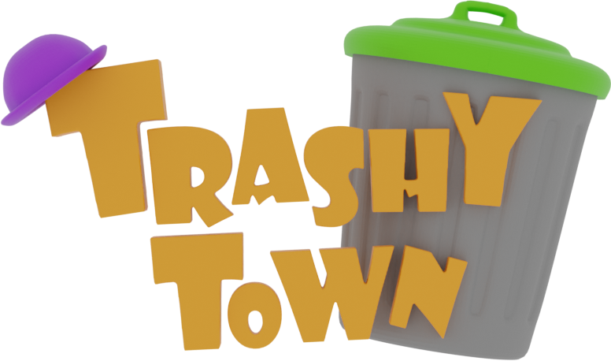

# Trashy Town



Developed for the [Global Gamers Challenge](https://globalgamers.devpost.com/) by [Alejandro Santiago](https://github.com/alestiago), [Ollie Pugh](https://github.com/OlliePugh) and [Samantha Helm](https://www.behance.net/samanthahelmdesign).

All assets were made in-house.

---

[Trashy Town](https://trashytown.com) is a sustainable, family-friendly game that promotes collectively cleaning and recycling public spaces. Have fun helping Gary collect all the trash of his Trashy Town and recyle it into the correct trash cans.

<!-- Thumbnail with a play icon on the middle that anchors to the video, goes here --->

## Playing

To start cleaning Trashy Town we recommend playing on **Desktop** 🖥 at [trashytown.com](https://trashytown.com).

💡 **Note**: [trashytown.com](https://trashytown.com) also works on **Mobile**.

Alternatively, you can run your own local version by using the Flutter SDK 3.19.0:

```sh
# 🕹️ Play your local version of Trashy Town (from packages/trashy_road):
flutter run -d chrome --release
```

💡 **Note**: You can also run Trashy Town locally on all the other available platforms (MacOS, Windows, Android, iOS, Linux and Web).

If instead, you wish to contribute refer to the [CONTRIBUTING](CONTRIBUTING.md).

### Controls

- 🖥 Desktop: move around with WASD or arrow keys.
- 📱 Mobile: tap to move forward or swipe to move vertically or horizontally.
